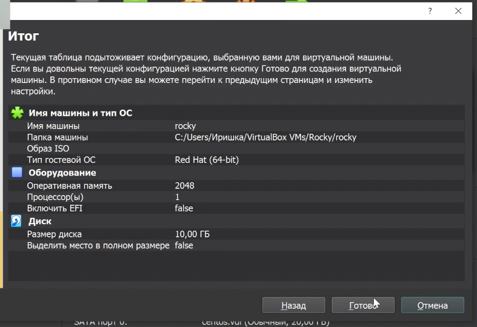
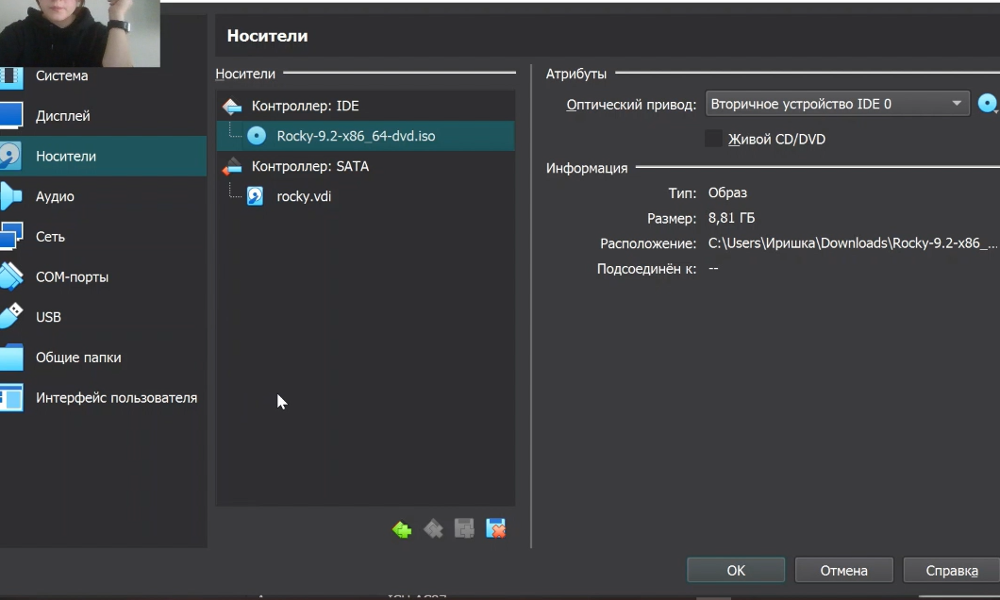
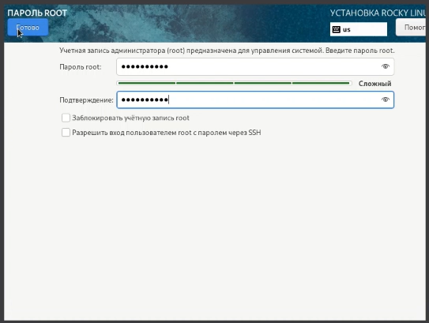
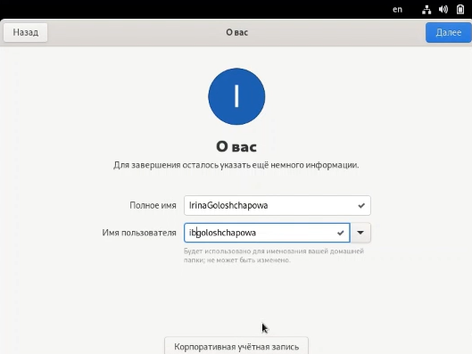
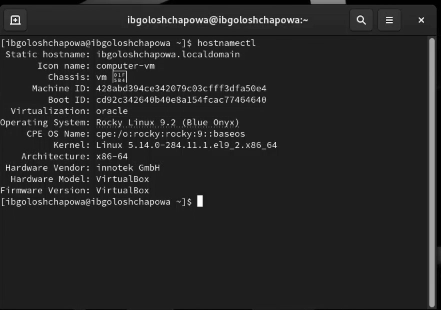
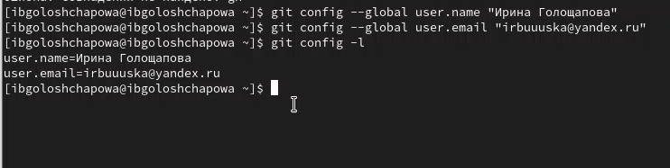
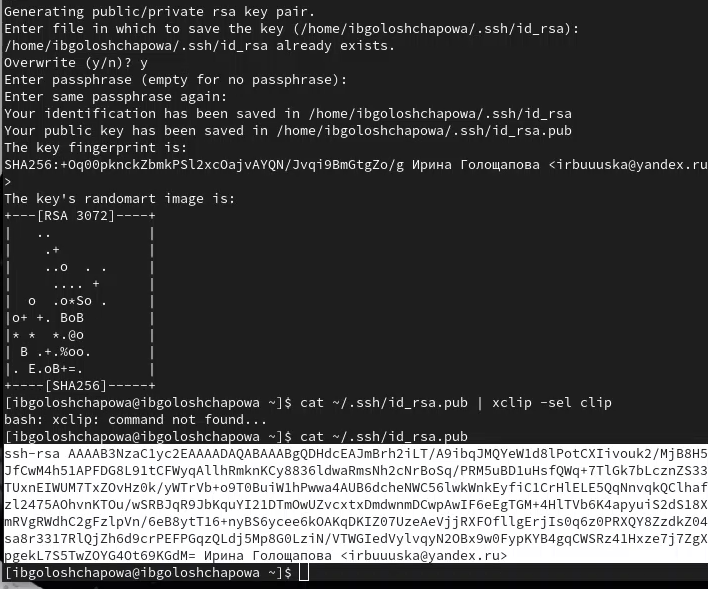
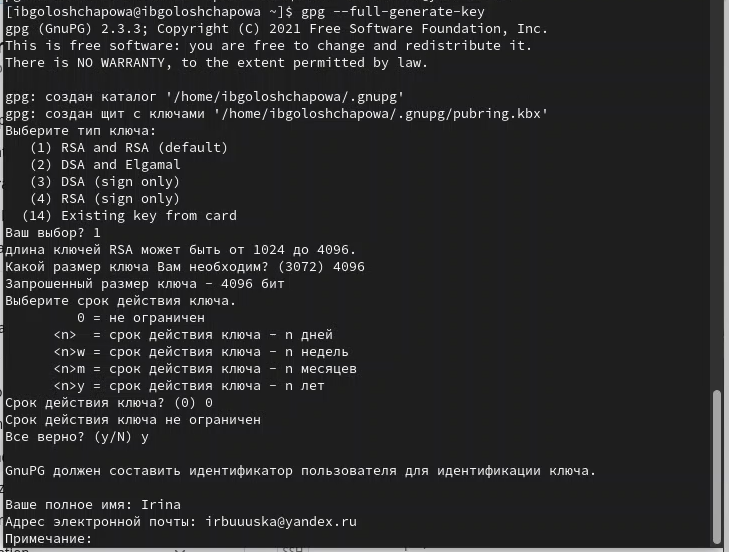
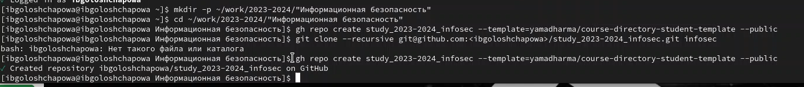

---
## Front matter
lang: ru-RU
title: Лабораторная работа №1
subtitle: "Установка и конфигурация операционной системы на виртуальную машину. Управление версиями"
author:
  - Голощапова Ирина Борисовна
institute:
  - Российский университет дружбы народов, Москва, Россия
date: 9 сентября 2023

## i18n babel
babel-lang: russian
babel-otherlangs: english

## Fonts
mainfont: PT Serif
romanfont: PT Serif
sansfont: PT Sans
monofont: PT Mono
mainfontoptions: Ligatures=TeX
romanfontoptions: Ligatures=TeX
sansfontoptions: Ligatures=TeX,Scale=MatchLowercase
monofontoptions: Scale=MatchLowercase,Scale=0.9

## Formatting pdf
toc: false
toc-title: Содержание
slide_level: 2
aspectratio: 169
section-titles: true
theme: metropolis
header-includes:
 - \metroset{progressbar=frametitle,sectionpage=progressbar,numbering=fraction}
 - '\makeatletter'
 - '\beamer@ignorenonframefalse'
 - '\makeatother'
---

# Информация

## Докладчик

:::::::::::::: {.columns align=center}
::: {.column width="70%"}

  * Голощапова Ирина Борисовна
  * студентка уч. группы НФИбд-01-20
  * Российский университет дружбы народов
  * [1032201666@pfur.ru](mailto:1032201666@pfur.ru)
  * <https://github.com/ibgoloshchapowa>

:::
::: {.column width="30%"}

:::
::::::::::::::

# Вводная часть

## Актуальность

Перед началом необходимо организовать рабочее пространство: настроить virtualBox, github, создать каталог курса и подготовить всё для дальнейшей работы.

## Объект и предмет исследования

- VirtualBox
- Дистрибутив Rocky
- Github.com

## Цели и задачи

Приобретение практических навыков
установки операционной системы на виртуальную машину, настройки минимально необходимых для дальнейшей работы сервисов.

- Установить операционную систему на виртуальную машину
- Изучить идеологию и применение средств контроля версий.
- Освоить умения по работе с git.

# Выполнение работы

## Установка дистрибутива Rocky
1. Кофигурация для новой виртуальной машины

{#fig:03 width=50%}

## Установка дистрибутива Rocky
 
2. Зашла в настройки созданной новой виртуальной машины и добавила заранее установленный оптический диск:

{#fig:04 width=50%}

## Установка дистрибутива Rocky

3. Далее настроила VB согласно методическому материалу, задала пароль root.

{#fig:08 width=50%}

## Установка дистрибутива Rocky

4. После настройки перезапустила систему для корректной установки.
Указала полное имя и имя пользователя:

{#fig:09 width=50%}

## Установка дистрибутива Rocky

5. Подключила образ диска дополнений гостевой ОС:

{#fig:10 width=50%}

## Установка дистрибутива Rocky

6. Проверила на корректность имя хоста:

{#fig:12 width=50%}

## Настройка git
1. Задала имя и email владельца репозитория:

{#fig:20 width=50%}

## Настройка git
2. Добавление ssh ключей:

{#fig:24 width=50%}

## Настройка git
3. Добавление gpg ключей:

{#fig:26 width=50%}

## Создание репозитория курса

1. Создала репозиторий согласно шаблону: 

{#fig:31 width=50%}

## Вывод

В ходе лабораторной работы нам удалось:

- Установить операционную систему на виртуальную машину.

- Изучить идеологию и применение средств контроля версий.

- Освоить умения по работе с git.

