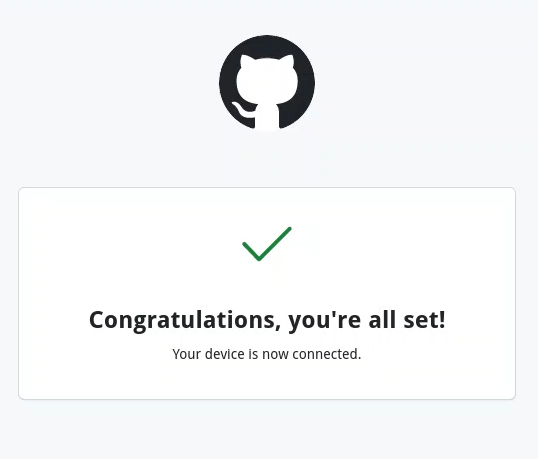

---
# Front matter
lang: ru-RU
title: "Отчёт по лабораторной работе №1"
subtitle: "Установка и конфигурация операционной системы на виртуальную машину. Управление версиями"
author: "Голощапова Ирина Борисовна"

# Formatting
toc-title: "Содержание"
toc: true # Table of contents
toc_depth: 2
lof: true # List of figures
lot: true # List of tables
fontsize: 12pt
linestretch: 1.5
papersize: a4paper
documentclass: scrreprt
polyglossia-lang: russian
polyglossia-otherlangs: english
mainfont: PT Serif
romanfont: PT Serif
sansfont: PT Sans
monofont: PT Mono
mainfontoptions: Ligatures=TeX
romanfontoptions: Ligatures=TeX
sansfontoptions: Ligatures=TeX,Scale=MatchLowercase
monofontoptions: Scale=MatchLowercase
indent: true
pdf-engine: lualatex
header-includes:
  - \linepenalty=10 # the penalty added to the badness of each line within a paragraph (no associated penalty node) Increasing the value makes tex try to have fewer lines in the paragraph.
  - \interlinepenalty=0 # value of the penalty (node) added after each line of a paragraph.
  - \hyphenpenalty=50 # the penalty for line breaking at an automatically inserted hyphen
  - \exhyphenpenalty=50 # the penalty for line breaking at an explicit hyphen
  - \binoppenalty=700 # the penalty for breaking a line at a binary operator
  - \relpenalty=500 # the penalty for breaking a line at a relation
  - \clubpenalty=150 # extra penalty for breaking after first line of a paragraph
  - \widowpenalty=150 # extra penalty for breaking before last line of a paragraph
  - \displaywidowpenalty=50 # extra penalty for breaking before last line before a display math
  - \brokenpenalty=100 # extra penalty for page breaking after a hyphenated line
  - \predisplaypenalty=10000 # penalty for breaking before a display
  - \postdisplaypenalty=0 # penalty for breaking after a display
  - \floatingpenalty = 20000 # penalty for splitting an insertion (can only be split footnote in standard LaTeX)
  - \raggedbottom # or \flushbottom
  - \usepackage{float} # keep figures where there are in the text
  - \floatplacement{figure}{H} # keep figures where there are in the text
---

# Цели и задачи лабораторной работы

## Цель работы

Приобретение практических навыков
установки операционной системы на виртуальную машину, настройки минимально необходимых для дальнейшей работы сервисов.

## Задачи работы

- Установить операционную систему на виртуальную машину
- Изучить идеологию и применение средств контроля версий.
- Освоить умения по работе с git.

# Выполнение лабораторной работы

## Установка дистрибутива Rocky

1. Открыла у себя на компьютере установленную заранее VirtualBox и создала новую виртуальную машину Rocky (рис. @fig:01):

{#fig:01 width=40%}

{#fig:02 width=40%}

{#fig:03 width=40%}

2. Зашла в настройки созданной новой виртуальной машины и добавила заранее установленный оптический диск (рис. @fig:04):

{#fig:04 width=40%}

3. Запустила созданную виртуальную машину и применила следующие настройки (рис. @fig:05):

{#fig:05 width=40%}

{#fig:06 width=40%}

{#fig:07 width=40%}

{#fig:08 width=40%}

4. Перезупустила систему для корректной установки.

5. Указала свое полное имя и имя пользователя (рис. @fig:09):

{#fig:09 width=40%}

6. Подключила образ диска дополнений гостевой ОС (рис. @fig:10):

{#fig:10 width=40%}

{#fig:11 width=40%}

7. Проверила на корректность имя хоста (рис. @fig:12):

{#fig:12 width=40%}

8. При помощи команды **dmesg | grep -i "то, что ищем"** получила следующие сведения: 

- версия ядра (рис. @fig:13):

{#fig:13 width=40%}

- частота процессора (рис. @fig:14):

{#fig:14 width=40%}

- модель процессора (рис. @fig:15):

{#fig:15 width=40%}

- объем доступной оперативной памяти (рис. @fig:16):

{#fig:16 width=40%}

- тип обнаруженного гипервизора (рис. @fig:17):

{#fig:17 width=40%}

- тип файловой системы корневого раздела (рис. @fig:18):

{#fig:18 width=40%}

- последовательность монтирования файловых систем (рис. @fig:19):

{#fig:19 width=40%}

## Настройка git

1. Задала имя и email владельца репозитория (рис. @fig:20):

{#fig:20 width=40%}

2. Настроила utf-8 в выводе сообщений git (рис. @fig:21):

{#fig:21 width=40%}

3. Настроила верификацию и подписание коммитов git. Задала имя начальной ветки (будем называть её master) (рис. @fig:22):

{#fig:22 width=40%}

4. Параметр autocrlf, Параметр safecrlf (рис. @fig:23):

{#fig:23 width=40%}

## Создание ключей

5. Добавление ssh ключей (рис. @fig:24):

{#fig:24 width=40%}

{#fig:25 width=40%}

6. Добавление gpg ключей (рис. @fig:26):

{#fig:26 width=40%}

{#fig:27 width=40%}

## Настройка автоматических подписей коммитов git

7. Настроила автоматические подписи (рис. @fig:28):

{#fig:28 width=40%}

## Настройка gh

8. Прошла авторизацию  (рис. @fig:29): 

{#fig:29 width=40%}

{#fig:30 width=40%}

## Создание репозитория курса

7. Создала репозиторий согласно шаблону  (рис. @fig:31): 

{#fig:31 width=40%}

{#fig:32 width=40%}

## Настройка каталога курса

8. Перешла в каталог курса, удалила ненужные файлы, создала необходимые каталоги и отправила файлы на сервер  (рис. @fig:33): 

{#fig:33 width=40%}

# Выводы

В ходе лабораторной работы нам удалось:

- Установить операционную систему на виртуальную машину.

- Изучить идеологию и применение средств контроля версий.

- Освоить умения по работе с git.

# Библиография
1. [Git - система контроля версий](https://github.com/)

2. [Rocky Linux](https://rockylinux.org/)
