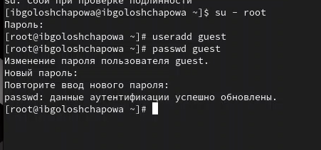
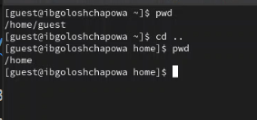
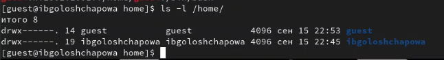
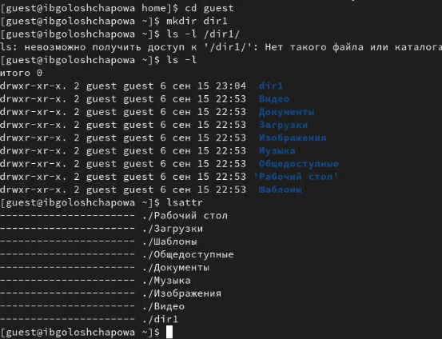
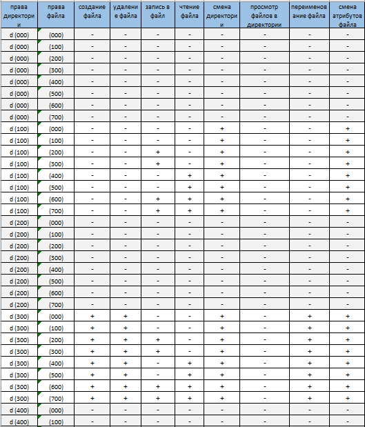
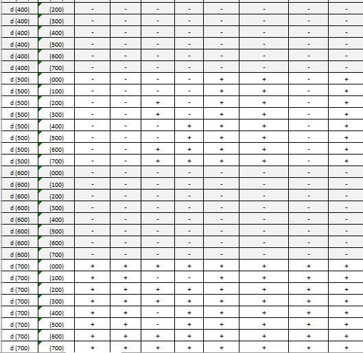
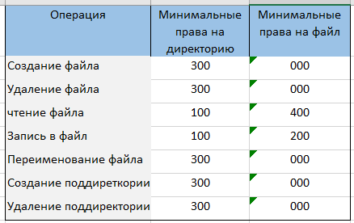

---
## Front matter
lang: ru-RU
title: Лабораторная работа №2
subtitle: "Дискреционное разграничение прав в Linux. Основные атрибуты"
author:
  - Голощапова Ирина Борисовна
institute:
  - Российский университет дружбы народов, Москва, Россия
date: 16 сентября 2023

## i18n babel
babel-lang: russian
babel-otherlangs: english

## Fonts
mainfont: PT Serif
romanfont: PT Serif
sansfont: PT Sans
monofont: PT Mono
mainfontoptions: Ligatures=TeX
romanfontoptions: Ligatures=TeX
sansfontoptions: Ligatures=TeX,Scale=MatchLowercase
monofontoptions: Scale=MatchLowercase,Scale=0.9

## Formatting pdf
toc: false
toc-title: Содержание
slide_level: 2
aspectratio: 169
section-titles: true
theme: metropolis
header-includes:
 - \metroset{progressbar=frametitle,sectionpage=progressbar,numbering=fraction}
 - '\makeatletter'
 - '\beamer@ignorenonframefalse'
 - '\makeatother'
---

# Информация

## Докладчик

:::::::::::::: {.columns align=center}
::: {.column width="70%"}

  * Голощапова Ирина Борисовна
  * студентка уч. группы НФИбд-01-20
  * Российский университет дружбы народов
  * [1032201666@pfur.ru](mailto:1032201666@pfur.ru)
  * <https://github.com/ibgoloshchapowa>

:::
::: {.column width="30%"}

:::
::::::::::::::

# Вводная часть

## Актуальность

Логические объекты файловой системы (файлы) являются носителями своеобразных меток, которые привычно называют правами доступа. Некоторые метки действительно означают право выполнения определенного действия пользователя над этим объектом. Важно изучить их для дальнейшего применения на практике.

## Объект и предмет исследования

- Атрибуты файлов
- Дистрибутив Rocky
- Дискреционное разграничение доступа

## Цели и задачи

Получение практических навыков работы в консоли с атрибутами файлов, закрепление теоретических основ дискреционного разграничения доступа в современных системах с открытым кодом на базе ОС Linux.

# Выполнение работы

## Выполнение работы

1. В установленной при выполнении предыдущей лабораторной работы операционной системе создала учётную запись пользователя guest (использую учётную запись администратора). Задала пароль для пользователя guest

{#fig:01 width=50%}

## Выполнение работы

2. Войшла в систему от имени пользователя guest. 
Определила директорию, в которой нахожусь, командой $pwd$. Она не оказалась домашней, поэтому осуществила переход в домашнюю директорию 

{#fig:02 width=50%}

## Выполнение работы

3. Определила существующие в системе директории командой
    $ls -l /home/$

{#fig:05 width=50%}

## Выполнение работы

4. Создала в домашней директории поддиректорию dir1

{#fig:07 width=50%}

## Установленные права и разрешённые действия

5. Заполнила таблицу «Установленные права и разрешённые действия»

{#fig:09 width=40%}

## Установленные права и разрешённые действия

{#fig:10 width=40%}

## Минимально необходимые права

На основании заполненной таблицы определила те или иные минимально необходимые права для выполнения операций внутри директории dir1

{#fig:11 width=50%}

## Вывод

В ходе лабораторной работы нам удалось:

получить практические навыки работы в консоли с атрибутами файлов, закрепить теоретические основы дискреционного разграничения доступа в современных системах с открытым кодом на базе ОС Linux.

