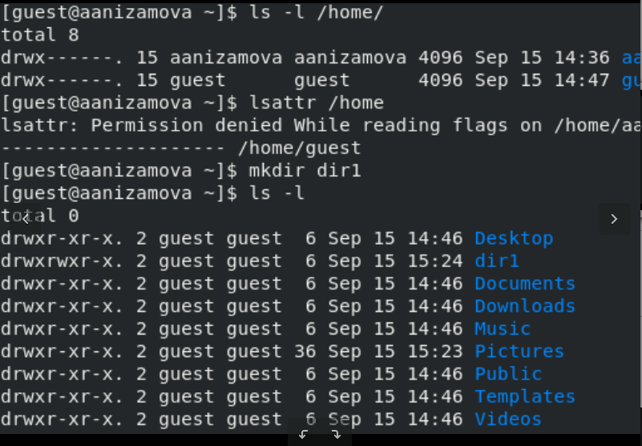

---
## Front matter
lang: ru-RU
title: Презентации ЛР №2
author:
  - Низамова А. А. НФИбд-01-20
institute:
  - Российский университет дружбы народов, Москва, Россия
date: 15 сентября 2023

## i18n babel
babel-lang: russian
babel-otherlangs: english

## Formatting pdf
toc: false
toc-title: Содержание
slide_level: 2
aspectratio: 169
section-titles: true
theme: metropolis
header-includes:
 - \metroset{progressbar=frametitle,sectionpage=progressbar,numbering=fraction}
 - '\makeatletter'
 - '\beamer@ignorenonframefalse'
 - '\makeatother'
---

# Информация

## Докладчик

:::::::::::::: {.columns align=center}
::: {.column width="70%"}

  * Низамова А. А. 
  * НФИбд-01-20
:::
::: {.column width="30%"}

:::
::::::::::::::

# Вводная часть

## Цели

Получение практических навыков работы в консоли с атрибутами файлов, закрепление теоретических основ дискреционного разграничения доступа в современных системах с открытым кодом на базе ОС Linux.

# Ход работы

## 1 

 В установленной при выполнении предыдущей лабораторной работы
операционной системе создала учётную запись пользователя guest (использую учётную запись администратора) (рис.1)

## 2

 Задаю пароль для пользователя guest (использую учётную запись администратора) (рис.1)

## 3 - 5

 Вошла в систему от имени пользователя guest. (рис.2)

 Определила директорию, в которой нахожусь, командой pwd. Сравнила её с приглашением командной строки. Она является домашней директорией. (рис.2)

 Уточнила имя пользователя командой whoami.(рис.2)

## 6 - 7

 Уточнила имя пользователя, его группу, а также группы, куда входит пользователь, командой id. Сравнила вывод id с выводом команды groups.(рис.2)

 Сравнила полученную информацию об имени пользователя с данными,
выводимыми в приглашении командной строки.(рис.2)

## 8

Просмотрела файл /etc/passwd командой
cat /etc/passwd
Нашла в нём свою учётную запись(в самом конце). Определила uid пользователя(1001).
Определила gid пользователя(1001). Сравнила найденные значения с полученными в предыдущих пунктах(значения одинаковы).(рис.2)

## 9 - 10
 Определила существующие в системе директории командой
ls -l /home/
Нам удалось получить список поддиректорий директории /home.(рис.3)

Проверила, какие расширенные атрибуты установлены на поддиректориях, находящихся в директории /home, командой:
lsattr /home
Нам не удалось  увидеть расширенные атрибуты директории. (рис.3)

## 11
 Создала в домашней директории поддиректорию dir1 командой
mkdir dir1
Определила командами ls -l и lsattr, какие права доступа и расширенные атрибуты были выставлены на директорию dir1. (рис.3 и рис.4)

## 12
 Сняла с директории dir1 все атрибуты командой
chmod 000 dir1
и проверила с её помощью правильность выполнения команды
ls -l (рис.4)

## 13
 Попыталась создать в директории dir1 файл file1 командой
echo "test" > /home/guest/dir1/file1
Т. к. мы сняли все атрибуты с директории в прошлом пункте, мы получили отказ в выполнении операции по созданию файла.
Файл не создался. Проверила командой
ls -l /home/guest/dir1
действительно ли файл file1 не находится внутри директории dir1. (рис.5)

## 14
 Заполнила таблицу «Установленные права и разрешённые действия», выполняя действия от имени владельца директории (файлов), определив опытным путём, какие операции разрешены, а какие нет.
Если операция разрешена, занесла в таблицу знак «+», если не разрешена, знак «-». (рис.6 и рис.7)

## Таблица ч.1

## Таблица ч.2

## 15
 На основании заполненной таблицы определила те или иные минимально необходимые права для выполнения операций внутри директории
dir1, заполнила табл. (рис.8)

# Выводы

Мы получили практические навыки работы в консоли с атрибутами файлов, закрепление теоретических основ дискреционного разграничения доступа в современных системах с открытым кодом на базе ОС Linux.
