---
# Front matter
lang: ru-RU
title: "Отчёт по лабораторной работе №1"
subtitle: "Дискреционное разграничение прав в Linux. Основные атрибуты"
author: "Голощапова Ирина Борисовна"

# Formatting
toc-title: "Содержание"
toc: true # Table of contents
toc_depth: 2
lof: true # List of figures
lot: true # List of tables
fontsize: 12pt
linestretch: 1.5
papersize: a4paper
documentclass: scrreprt
polyglossia-lang: russian
polyglossia-otherlangs: english
mainfont: PT Serif
romanfont: PT Serif
sansfont: PT Sans
monofont: PT Mono
mainfontoptions: Ligatures=TeX
romanfontoptions: Ligatures=TeX
sansfontoptions: Ligatures=TeX,Scale=MatchLowercase
monofontoptions: Scale=MatchLowercase
indent: true
pdf-engine: lualatex
header-includes:
  - \linepenalty=10 # the penalty added to the badness of each line within a paragraph (no associated penalty node) Increasing the value makes tex try to have fewer lines in the paragraph.
  - \interlinepenalty=0 # value of the penalty (node) added after each line of a paragraph.
  - \hyphenpenalty=50 # the penalty for line breaking at an automatically inserted hyphen
  - \exhyphenpenalty=50 # the penalty for line breaking at an explicit hyphen
  - \binoppenalty=700 # the penalty for breaking a line at a binary operator
  - \relpenalty=500 # the penalty for breaking a line at a relation
  - \clubpenalty=150 # extra penalty for breaking after first line of a paragraph
  - \widowpenalty=150 # extra penalty for breaking before last line of a paragraph
  - \displaywidowpenalty=50 # extra penalty for breaking before last line before a display math
  - \brokenpenalty=100 # extra penalty for page breaking after a hyphenated line
  - \predisplaypenalty=10000 # penalty for breaking before a display
  - \postdisplaypenalty=0 # penalty for breaking after a display
  - \floatingpenalty = 20000 # penalty for splitting an insertion (can only be split footnote in standard LaTeX)
  - \raggedbottom # or \flushbottom
  - \usepackage{float} # keep figures where there are in the text
  - \floatplacement{figure}{H} # keep figures where there are in the text
---

# Цели и задачи лабораторной работы

## Цели и задачи работы

Получение практических навыков работы в консоли с атрибутами файлов, закрепление теоретических основ дискреционного разграничения доступа в современных системах с открытым кодом на базе ОС Linux.

# Выполнение лабораторной работы

1. В установленной при выполнении предыдущей лабораторной работы операционной системе создала учётную запись пользователя guest (использую учётную запись администратора). Задала пароль для пользователя guest (рис. @fig:01):

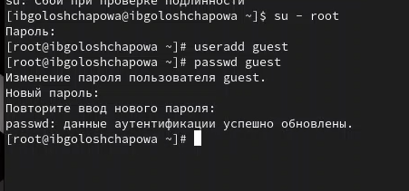{#fig:01 width=50%}

2. Войшла в систему от имени пользователя guest. 
Определила директорию, в которой нахожусь, командой $pwd$. Она не оказалась домашней, поэтому осуществила переход в домашнюю директорию (рис. @fig:02):

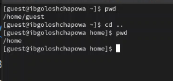{#fig:02 width=50%}

3. Уточнила имя пользователя, его группу, а также группы, куда входит пользователь, командой id. Выведенные значения uid, gid и др. запомнила. Сравнила вывод id с выводом команды groups (рис. @fig:03):

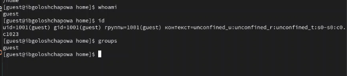{#fig:03 width=50%}

4. Просмотрела файл /etc/passwd командой $cat /etc/passwd$
Найшла в нём свою учётную запись. Определила uid, gid пользователя (рис. @fig:04):
 
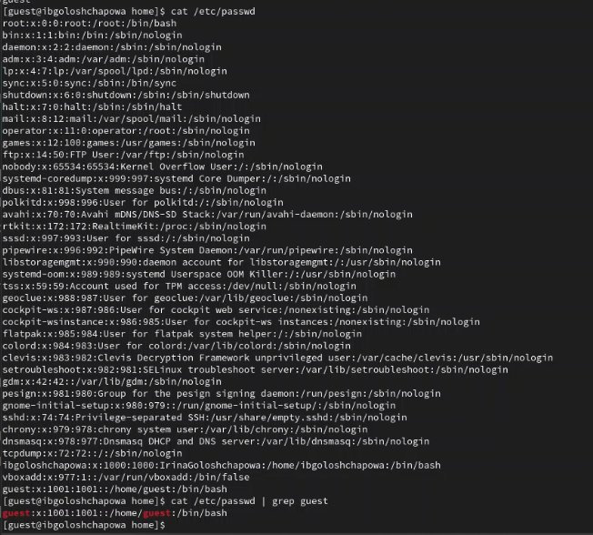{#fig:04 width=50%}

5. Определите существующие в системе директории командой
    $ls -l /home/$
Удалось ли вам получить список поддиректорий директории /home? Какие права установлены на директориях? (рис. @fig:05):

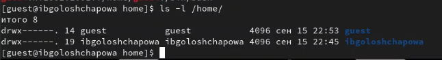{#fig:05 width=50%}

6. Проверила, какие расширенные атрибуты установлены на поддиректориях, находящихся в директории /home, командой:
$lsattr /home$. (рис. @fig:06):

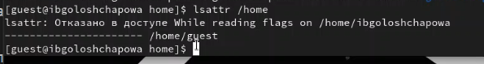{#fig:06 width=50%}

Не удалось увидеть расширенные атрибуты директории, так как отказано в доступе.

7. Создала в домашней директории поддиректорию dir1 командой
mkdir dir1
Определила командами ls -l и lsattr, какие права доступа и расширенные атрибуты были выставлены на директорию dir1 (рис. @fig:07):

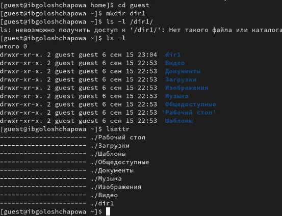{#fig:07 width=50%}

9. Сняла с директории dir1 все атрибуты командой
chmod 000 dir1
и проверилв с её помощью правильность выполнения команды
ls -l

Попыталась создать в директории dir1 файл file1 командой
echo "test" > /home/guest/dir1/file1

Я получила отказ в выполнении операции по созданию файла, так как до этого убрала права на все действия по отношению к данной директории (рис. @fig:08): 

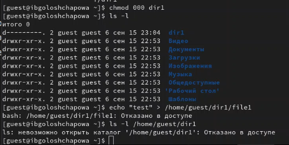{#fig:08 width=50%}

11. Заполнила таблицу «Установленные права и разрешённые действия» выполняя действия от имени владельца директории (файлов), определив опытным путём, какие операции разрешены, а какие нет.
Если операция разрешена, занесла в таблицу знак «+», если не разрешена, знак «-» (рис. @fig:09):

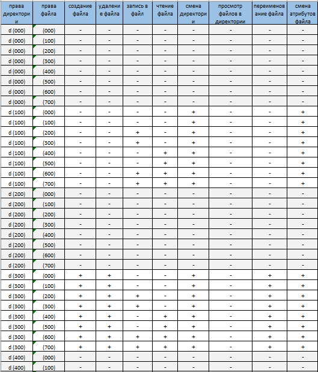{#fig:09 width=50%}

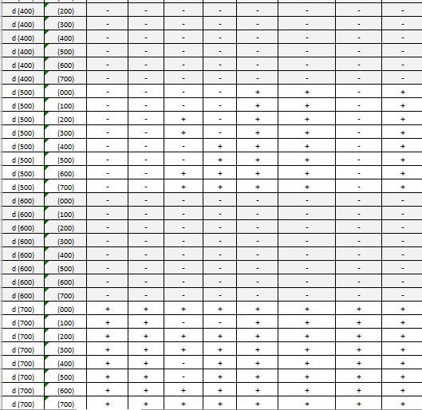{#fig:10 width=50%}

12. На основании заполненной таблицы определила те или иные минимально необходимые права для выполнения операций внутри директории dir1 (рис. @fig:11):

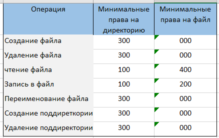{#fig:11 width=50%}

# Выводы

В ходе лабораторной работы нам удалось:

Получить практические навыки работы в консоли с атрибутами файлов, закрепить теоретические основы дискреционного разграничения доступа в современных системах с открытым кодом на базе ОС Linux.

# Библиография
1. [Git - система контроля версий](https://github.com/)

2. [Rocky Linux](https://rockylinux.org/)
