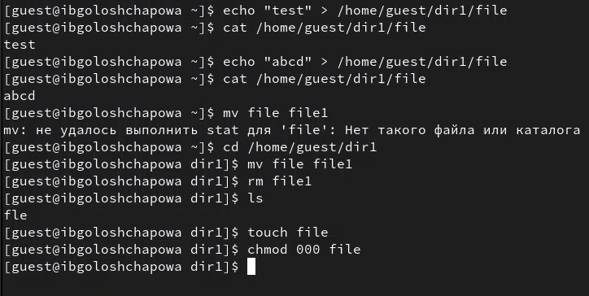

---
## Front matter
lang: ru-RU
title: Лабораторная работа №4
subtitle: "Дискреционное разграничение прав в Linux. Расширенные атрибуты"
author:
  - Голощапова Ирина Борисовна
institute:
  - Российский университет дружбы народов, Москва, Россия
date: 30 сентября 2023

## i18n babel
babel-lang: russian
babel-otherlangs: english

## Fonts
mainfont: PT Serif
romanfont: PT Serif
sansfont: PT Sans
monofont: PT Mono
mainfontoptions: Ligatures=TeX
romanfontoptions: Ligatures=TeX
sansfontoptions: Ligatures=TeX,Scale=MatchLowercase
monofontoptions: Scale=MatchLowercase,Scale=0.9

## Formatting pdf
toc: false
toc-title: Содержание
slide_level: 2
aspectratio: 169
section-titles: true
theme: metropolis
header-includes:
 - \metroset{progressbar=frametitle,sectionpage=progressbar,numbering=fraction}
 - '\makeatletter'
 - '\beamer@ignorenonframefalse'
 - '\makeatother'
---

# Информация

## Докладчик

:::::::::::::: {.columns align=center}
::: {.column width="70%"}

  * Голощапова Ирина Борисовна
  * студентка уч. группы НФИбд-01-20
  * Российский университет дружбы народов
  * [1032201666@pfur.ru](mailto:1032201666@pfur.ru)
  * <https://github.com/ibgoloshchapowa>

:::
::: {.column width="30%"}

:::
::::::::::::::

# Вводная часть

## Актуальность

Логические объекты файловой системы (файлы) являются носителями своеобразных меток, которые привычно называют правами доступа. Некоторые метки действительно означают право выполнения определенного действия пользователя над этим объектом. Важно изучить их для дальнейшего применения на практике.

## Объект и предмет исследования

- Атрибуты файлов
- Дистрибутив Rocky
- Дискреционное разграничение доступа

## Цели и задачи

Получение практических навыков работы в консоли с расширенными атрибутами файлов

# Выполнение работы

## Выполнение работы

1. Определила расширенные атрибуты файла командой
$$lsattr /home/guest/dir1/file1$$ 
и установила права, разрешающие чтение и запись для владельца файла:
$$chmod \ 600 \ file1$$ 

{#fig:01 width=50%}

## Выполнение работы

2. Зашла на третью консоль с правами администратора. Установила расширенный атрибут a на файл от имени суперпользователя и проверила правильность установления атрибута:

{#fig:03 width=50%}

## Выполнение команд с атрибутом а

3. С установленным расширенным атрибутом а выполнила следущие команды:

{#fig:04 width=50%}

## Выполнение команд без атрибута а

4. Убрав расширенный атрибут а, выполнила следующие команды:

{#fig:05 width=50%}

## Выполнение команд с атрибутом i

5. С установленным расширенным атрибутом i выполнила следущие команды:

{#fig:06 width=50%}

## Выполнение команд без атрибута i

6. Убрав расширенный атрибут i, выполнила следующие команды:

{#fig:07 width=50%}

## Заполнение таблицы

7. Занеслаа полученные данные в таблицу:

{#fig:08 width=50%}

## Вывод

В ходе лабораторной работы мне удалось повысить свои навыки использования интерфейса командой строки (CLI), познакомиться на примерах с тем, как используются основные и расширенные атрибуты при разграничении доступа. Также была возможность связать теорию дискреционного разделения доступа (дискреционная политика безопасности) с её реализацией на практике в ОС Linux. Составила наглядные таблицы, поясняющие какие операции возможны при тех или иных установленных правах. Опробовала действие на практике расширенных атрибутов «а» и «i».

