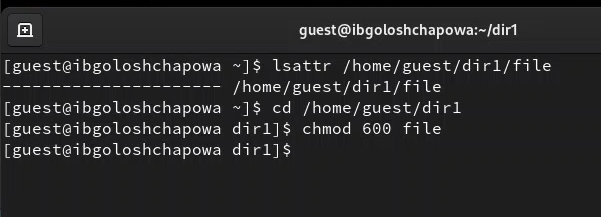
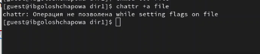
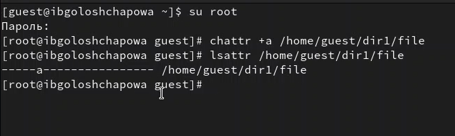
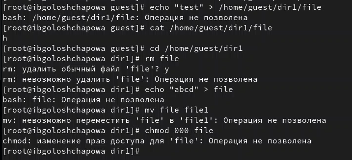
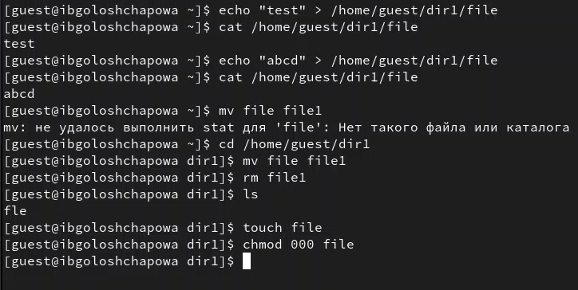
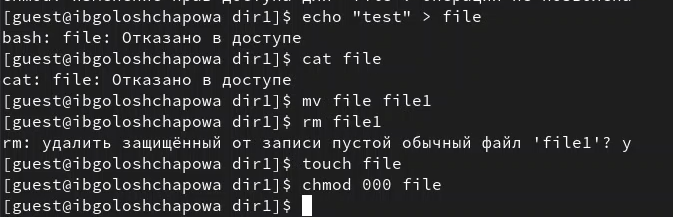
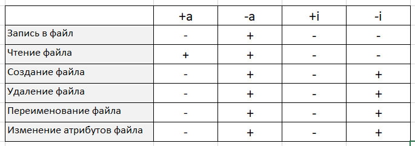

---
# Front matter
lang: ru-RU
title: "Отчёт по лабораторной работе №4"
subtitle: "Дискреционное разграничение прав в Linux. Расширенные атрибуты"
author: "Голощапова Ирина Борисовна"

# Formatting
toc-title: "Содержание"
toc: true # Table of contents
toc_depth: 2
lof: true # List of figures
lot: true # List of tables
fontsize: 12pt
linestretch: 1.5
papersize: a4paper
documentclass: scrreprt
polyglossia-lang: russian
polyglossia-otherlangs: english
mainfont: PT Serif
romanfont: PT Serif
sansfont: PT Sans
monofont: PT Mono
mainfontoptions: Ligatures=TeX
romanfontoptions: Ligatures=TeX
sansfontoptions: Ligatures=TeX,Scale=MatchLowercase
monofontoptions: Scale=MatchLowercase
indent: true
pdf-engine: lualatex
header-includes:
  - \linepenalty=10 # the penalty added to the badness of each line within a paragraph (no associated penalty node) Increasing the value makes tex try to have fewer lines in the paragraph.
  - \interlinepenalty=0 # value of the penalty (node) added after each line of a paragraph.
  - \hyphenpenalty=50 # the penalty for line breaking at an automatically inserted hyphen
  - \exhyphenpenalty=50 # the penalty for line breaking at an explicit hyphen
  - \binoppenalty=700 # the penalty for breaking a line at a binary operator
  - \relpenalty=500 # the penalty for breaking a line at a relation
  - \clubpenalty=150 # extra penalty for breaking after first line of a paragraph
  - \widowpenalty=150 # extra penalty for breaking before last line of a paragraph
  - \displaywidowpenalty=50 # extra penalty for breaking before last line before a display math
  - \brokenpenalty=100 # extra penalty for page breaking after a hyphenated line
  - \predisplaypenalty=10000 # penalty for breaking before a display
  - \postdisplaypenalty=0 # penalty for breaking after a display
  - \floatingpenalty = 20000 # penalty for splitting an insertion (can only be split footnote in standard LaTeX)
  - \raggedbottom # or \flushbottom
  - \usepackage{float} # keep figures where there are in the text
  - \floatplacement{figure}{H} # keep figures where there are in the text
---

# Цели и задачи лабораторной работы

## Цели и задачи работы

Получение практических навыков работы в консоли с расширенными атрибутами файлов

# Выполнение лабораторной работы

1. От имени пользователя guest определила расширенные атрибуты файла */home/guest/dir1/file1* командой
$$lsattr /home/guest/dir1/file1$$ 
и установила на файл file1 права, разрешающие чтение и запись для владельца файла (рис. @fig:01) следующей командой:
$$chmod \ 600 \ file1$$ 

{#fig:01 width=50%}

2. Попробовала установить на файл file1 расширенный атрибут a от имени пользователя guest:
$$chattr +a /home/guest/dir1/file1$$
В ответ получила отказ от выполнения операции (рис. @fig:02)

{#fig:02 width=50%}

3. Зашла на третью консоль с правами администратора. Попробовала установить расширенный атрибут a на файл */home/guest/dir1/file1* от имени суперпользователя:
$$chattr +a /home/guest/dir1/file1$$

и от пользователя guest проверила правильность установления атрибута (рис. @fig:03):
$$lsattr /home/guest/dir1/file1$$

{#fig:03 width=50%}

5. Выполнила:
 
 - дозапись в файл file1 слова «test» командой
$$echo "test" /home/guest/dir1/file1$$

 - чтение файла file1 командой
$$cat /home/guest/dir1/file1$$

Убедитесь, что слово test было успешно записано в file1.

 - Попробовала удалить файл file1 либо стереть имеющуюся в нём информацию командой
$$echo "abcd" > /home/guest/dirl/file1$$
 
 - Попробовала переименовать файл.

 - Попробовала с помощью команды 
$$chmod 000 file1$$

установить на файл file1 права, например, запрещающие чтение и запись для владельца файла. В итоге нам не удалось успешно выполнить указанные команды (рис. @fig:04):

{#fig:04 width=50%}

6. Сняла расширенный атрибут *a* с файла */home/guest/dirl/file1* от
имени суперпользователя командой
$$chattr -a /home/guest/dir1/file1$$
Повторила операции, которые ранее не удавалось выполнить (рис. @fig:05): 

{#fig:05 width=50%}

7. Повторила действия по шагам, заменив атрибут «a» атрибутом «i» (рис. @fig:06): 

{#fig:06 width=50%}

8. Повторила действия по шагам, удалив атрибут i (рис. @fig:07): 

{#fig:07 width=50%}

9. Занеслаа полученные данные в таблицу (рис. @fig:08):

{#fig:08 width=50%}

# Выводы

В ходе лабораторной работы мне удалось повысить свои навыки использования интерфейса командой строки (CLI), познакомиться на примерах с тем, как используются основные и расширенные атрибуты при разграничении доступа. Также была возможность связать теорию дискреционного разделения доступа (дискреционная политика безопасности) с её реализацией на практике в ОС Linux. Составила наглядные таблицы, поясняющие какие операции возможны при тех или иных установленных правах. Опробовала действие на практике расширенных атрибутов «а» и «i».

# Библиография
1. [Git - система контроля версий](https://github.com/)

2. [Rocky Linux](https://rockylinux.org/)
