---
## Front matter
lang: ru-RU
title: Лабораторная работа №5
subtitle: "Дискреционное разграничение прав в Linux. Исследование влияния дополнительных атрибутов"
author:
  - Голощапова Ирина Борисовна
institute:
  - Российский университет дружбы народов, Москва, Россия
date: 7 октября 2023

## i18n babel
babel-lang: russian
babel-otherlangs: english

## Fonts
mainfont: PT Serif
romanfont: PT Serif
sansfont: PT Sans
monofont: PT Mono
mainfontoptions: Ligatures=TeX
romanfontoptions: Ligatures=TeX
sansfontoptions: Ligatures=TeX,Scale=MatchLowercase
monofontoptions: Scale=MatchLowercase,Scale=0.9

## Formatting pdf
toc: false
toc-title: Содержание
slide_level: 2
aspectratio: 169
section-titles: true
theme: metropolis
header-includes:
 - \metroset{progressbar=frametitle,sectionpage=progressbar,numbering=fraction}
 - '\makeatletter'
 - '\beamer@ignorenonframefalse'
 - '\makeatother'
---

# Информация

## Докладчик

:::::::::::::: {.columns align=center}
::: {.column width="70%"}

  * Голощапова Ирина Борисовна
  * студентка уч. группы НФИбд-01-20
  * Российский университет дружбы народов
  * [1032201666@pfur.ru](mailto:1032201666@pfur.ru)
  * <https://github.com/ibgoloshchapowa>

:::
::: {.column width="30%"}

:::
::::::::::::::

# Вводная часть

## Актуальность

Логические объекты файловой системы (файлы) являются носителями своеобразных меток, которые привычно называют правами доступа. Некоторые метки действительно означают право выполнения определенного действия пользователя над этим объектом. Важно изучить их для дальнейшего применения на практике.

## Объект и предмет исследования

- Атрибуты файлов
- Дистрибутив Rocky
- Дискреционное разграничение доступа

## Цели и задачи

Изучение механизмов изменения идентификаторов, применения
SetUID- и Sticky-битов. Получение практических навыков работы в консоли с дополнительными атрибутами. Рассмотрение работы механизма
смены идентификатора процессов пользователей, а также влияние бита Sticky на запись и удаление файлов.

# Выполнение работы

## Создание программы

1. С правами администратора установила компилятор gcc

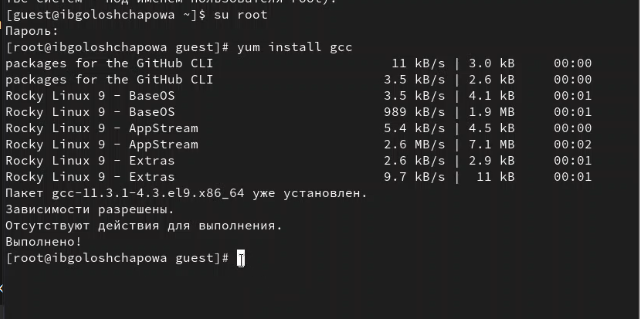{#fig:01 width=50%}

## Создание программы

2. Вошла в систему от имени пользователя guest и создала программу simpleid.c со следующим кодом

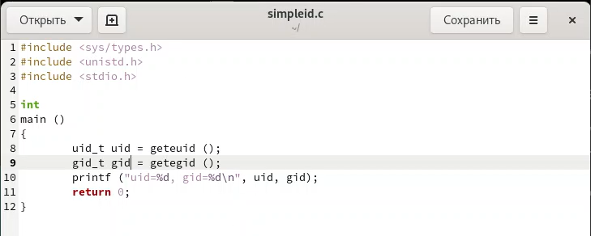{#fig:03 width=50%}

## Создание программы

3. Скомплилировала программу и убедилась, что файл программы создан. Далее выполнила программу simpleid и системную программу id, сравнив полученный  результат 

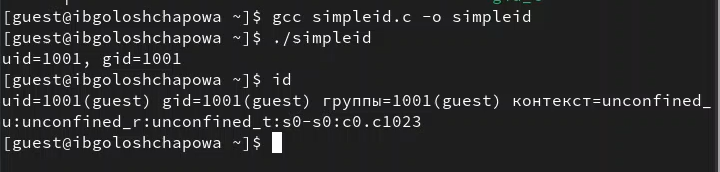{#fig:04 width=50%}

## Создание программы

4. Усложнила программу, добавив вывод действительных идентификаторов 

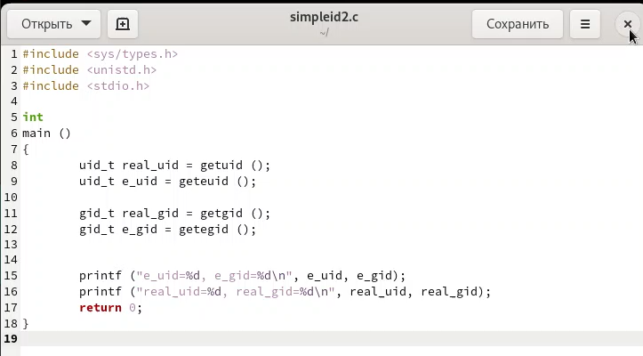{#fig:05 width=50%}

## Создание программы

5. Скомпилировала и запустила simpleid2.c 

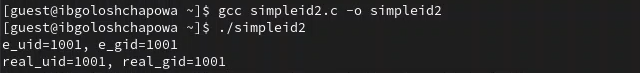{#fig:06 width=50%}

## Создание программы

6.  От имени суперпользователя выполнила команды, выполнила проверку правильности установки новых атрибутов и смены владельца файла simpleid2 и запустила simpleid2 и id:

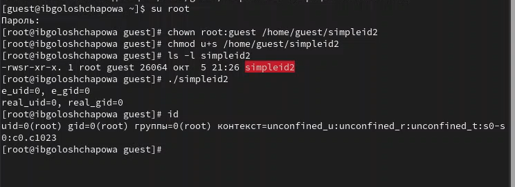{#fig:07 width=50%}

## Создание программы

7. Создала программу readfile.c 

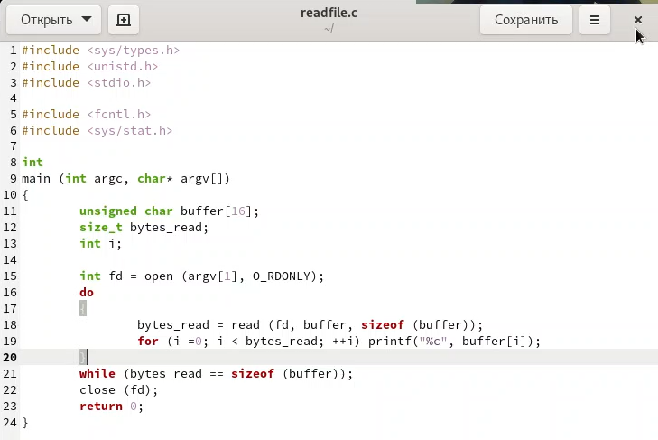{#fig:09 width=50%}

## Создание программы

8. Откомпилировала программу. Сменила владельца у файла readfile.c  и изменила права так, чтобы только суперпользователь мог прочитать его, a guest не мог 

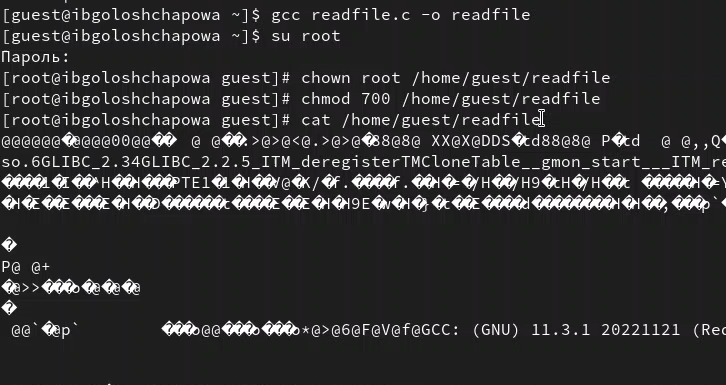{#fig:10 width=30%}

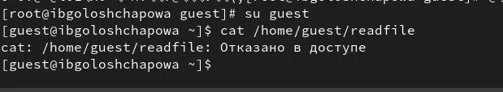{#fig:11 width=30%}

## Создание программы

9. Сменила у программы readfile владельца и установила SetU’D-бит. Проверила, может ли программа readfile прочитать файл readfile.c и файл /etc/shadow

 - От имени пользователя guest:
 
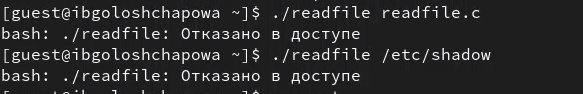{#fig:13 width=50%}

## Создание программы

 - С правами администратора: 

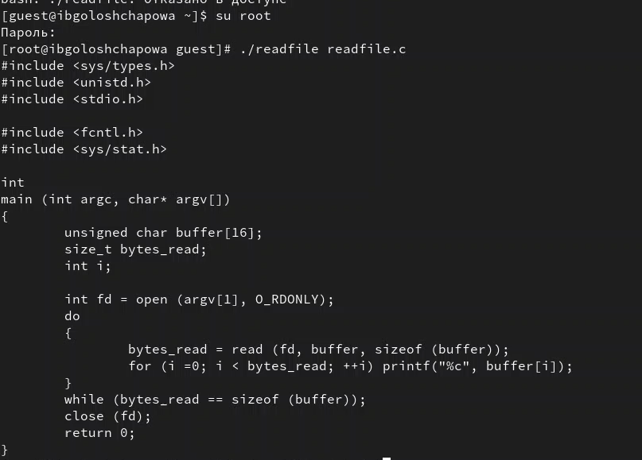{#fig:14 width=50%}

## Создание программы

Чтение файла /etc/shadow 

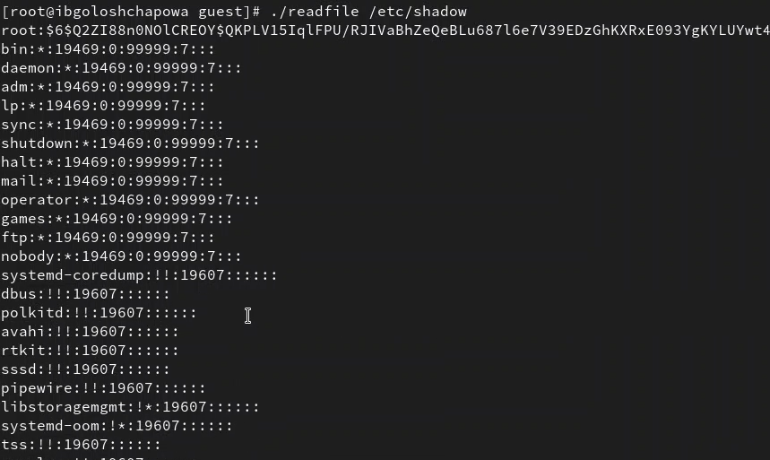{#fig:15 width=50%}

## Исследование Sticky-бита

1. Выяснила, что установлен атрибут Sticky на директории /tmp 

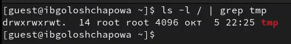{#fig:16 width=50%}

## Исследование Sticky-бита

2. От имени пользователя guest создала файл file01.txt в директории /tmp со словом test. Просмотрела атрибуты у только что созданного файла и разрешила чтение и запись для категории пользователей «все остальные» 

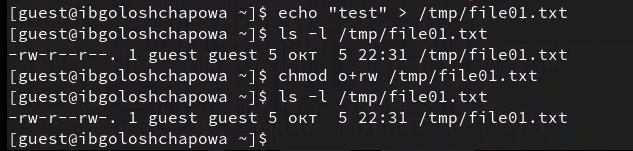{#fig:17 width=50%}

## Исследование Sticky-бита

3. От пользователя guest2 (не являющегося владельцем) попробовала прочитать файл /tmp/file01.txt, дозаписать в файл слово test2, проверить содержимое файла, записать в файл слово test3, стерев при этом всю имеющуюся в файле информацию командой и снова проверить содержимое файла. Затем попробовала удалить файл - не получилось 

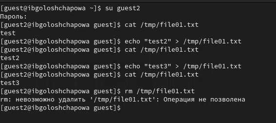{#fig:18 width=50%}

## Исследование Sticky-бита

4. Повысила свои права до суперпользователя 
и выполнила после этого команду, снимающую атрибут t (Sticky-бит) с директории. От пользователя guest2 проверила, что атрибута t у директории /tmp нет 

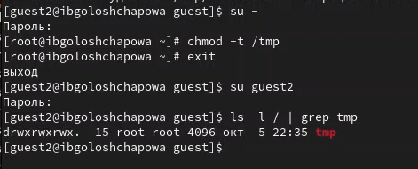{#fig:19 width=50%}

## Исследование Sticky-бита

5. Повторила предыдущие шаги 

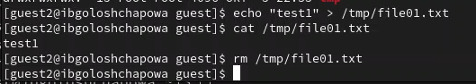{#fig:20 width=50%}

## Исследование Sticky-бита

6. Повысила свои права до суперпользователя и вернула атрибут t на директорию /tmp 

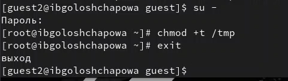{#fig:21 width=50%}

## Вывод

В ходе лабораторной работы мне удалось:

 - Изучить механизмы изменения идентификаторов, применения SetUID- и Sticky-битов. 
 
 - Получить практических навыков работы в консоли с дополнительными атрибутами. 
 
 - Рассмотреть работу механизма смены идентификатора процессов пользователей, а также влияние бита Sticky на запись и удаление файлов.

