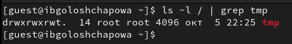

---
# Front matter
lang: ru-RU
title: "Отчёт по лабораторной работе №5"
subtitle: "Дискреционное разграничение прав в Linux. Исследование влияния дополнительных атрибутов"
author: "Голощапова Ирина Борисовна"

# Formatting
toc-title: "Содержание"
toc: true # Table of contents
toc_depth: 2
lof: true # List of figures
lot: true # List of tables
fontsize: 12pt
linestretch: 1.5
papersize: a4paper
documentclass: scrreprt
polyglossia-lang: russian
polyglossia-otherlangs: english
mainfont: PT Serif
romanfont: PT Serif
sansfont: PT Sans
monofont: PT Mono
mainfontoptions: Ligatures=TeX
romanfontoptions: Ligatures=TeX
sansfontoptions: Ligatures=TeX,Scale=MatchLowercase
monofontoptions: Scale=MatchLowercase
indent: true
pdf-engine: lualatex
header-includes:
  - \linepenalty=10 # the penalty added to the badness of each line within a paragraph (no associated penalty node) Increasing the value makes tex try to have fewer lines in the paragraph.
  - \interlinepenalty=0 # value of the penalty (node) added after each line of a paragraph.
  - \hyphenpenalty=50 # the penalty for line breaking at an automatically inserted hyphen
  - \exhyphenpenalty=50 # the penalty for line breaking at an explicit hyphen
  - \binoppenalty=700 # the penalty for breaking a line at a binary operator
  - \relpenalty=500 # the penalty for breaking a line at a relation
  - \clubpenalty=150 # extra penalty for breaking after first line of a paragraph
  - \widowpenalty=150 # extra penalty for breaking before last line of a paragraph
  - \displaywidowpenalty=50 # extra penalty for breaking before last line before a display math
  - \brokenpenalty=100 # extra penalty for page breaking after a hyphenated line
  - \predisplaypenalty=10000 # penalty for breaking before a display
  - \postdisplaypenalty=0 # penalty for breaking after a display
  - \floatingpenalty = 20000 # penalty for splitting an insertion (can only be split footnote in standard LaTeX)
  - \raggedbottom # or \flushbottom
  - \usepackage{float} # keep figures where there are in the text
  - \floatplacement{figure}{H} # keep figures where there are in the text
---

# Цели и задачи лабораторной работы

## Цели и задачи работы

Изучение механизмов изменения идентификаторов, применения
SetUID- и Sticky-битов. Получение практических навыков работы в консоли с дополнительными атрибутами. Рассмотрение работы механизма
смены идентификатора процессов пользователей, а также влияние бита Sticky на запись и удаление файлов.

# Выполнение лабораторной работы

## Создание программы

1. С правами администратора установила компилятор gcc (рис. @fig:01)

{#fig:01 width=50%}

2. Отключила систему запретов до очередной перезагрузки системы командой (рис. @fig:02)

{#fig:02 width=50%}

3. Вошла в систему от имени пользователя guest и создала программу simpleid.c со следующим кодом (рис. @fig:03)

{#fig:03 width=50%}

4. Скомплилировала программу и убедилась, что файл программы создан. Далее выполнила программу simpleid и системную программу id, сравнив полученный  результат (рис. @fig:04)

{#fig:04 width=50%}

5. Усложнила программу, добавив вывод действительных идентификаторов (рис. @fig:05):

{#fig:05 width=50%}

6. Скомпилировала и запустила simpleid2.c (рис. @fig:06):

{#fig:06 width=50%}

7. От имени суперпользователя выполнила команды, выполнила проверку правильности установки новых атрибутов и смены владельца файла simpleid2 и запустила simpleid2 и id (рис. @fig:07):

{#fig:07 width=50%}

8. Проделала тоже самое относительно SetGID-бита (рис. @fig:08):

{#fig:08 width=50%}

9. Создала программу readfile.c (рис. @fig:09):

{#fig:09 width=50%}

10. Откомпилировала её. Сменила владельца у файла readfile.c  и изменила права так, чтобы только суперпользователь
(root) мог прочитать его, a guest не мог (рис. @fig:10). 

{#fig:10 width=50%}

Проверила, что пользователь guest не может прочитать файл readfile.c (рис. @fig:11):

{#fig:11 width=50%}

11. Сменила у программы readfile владельца и установила SetU’D-бит (рис. @fig:12).

{#fig:12 width=50%}

Проверила, может ли программа readfile прочитать файл readfile.c.

Проверила, может ли программа readfile прочитать файл /etc/shadow (рис. @fig:13).

 - От имени пользователя guest:

{#fig:13 width=50%}

 - С правами администратора (рис. @fig:14): 

{#fig:14 width=50%}

Чтение файла /etc/shadow (рис. @fig:15)

{#fig:15 width=50%}

## Исследование Sticky-бита

1. Выяснила, что установлен атрибут Sticky на директории /tmp  (рис. @fig:16)

{#fig:16 width=50%}

2. От имени пользователя guest создала файл file01.txt в директории /tmp со словом test. Просмотрела атрибуты у только что созданного файла и разрешила чтение и запись для категории пользователей «все остальные» (рис. @fig:17)

{#fig:17 width=50%}

3. От пользователя guest2 (не являющегося владельцем) попробовала прочитать файл /tmp/file01.txt, дозаписать в файл слово test2, проверить содержимое файла, записать в файл слово test3, стерев при этом всю имеющуюся в файле информацию командой и снова проверить содержимое файла. Затем попробовала удалить файл - не получилось (рис. @fig:18)

{#fig:18 width=50%}

4. Повысила свои права до суперпользователя 
и выполнила после этого команду, снимающую атрибут t (Sticky-бит) с директории. От пользователя guest2 проверила, что атрибута t у директории /tmp нет (рис. @fig:19)

{#fig:19 width=50%}

5. Повторила предыдущие шаги (рис. @fig:20)

{#fig:20 width=50%}

6. Повысила свои права до суперпользователя и вернула атрибут t на директорию /tmp (рис. @fig:21)

{#fig:21 width=50%}

# Выводы

В ходе лабораторной работы мне удалось:

 - Изучить механизмы изменения идентификаторов, применения SetUID- и Sticky-битов. 
 
 - Получить практических навыков работы в консоли с дополнительными атрибутами. 
 
 - Рассмотреть работу механизма смены идентификатора процессов пользователей, а также влияние бита Sticky на запись и удаление файлов.

# Библиография
1. [Git - система контроля версий](https://github.com/)

2. [Rocky Linux](https://rockylinux.org/)
