---
## Front matter
lang: ru-RU
title: Лабораторная работа №6
subtitle: "Мандатное разграничение прав в Linux"
author:
  - Голощапова Ирина Борисовна
institute:
  - Российский университет дружбы народов, Москва, Россия
date: 14 октября 2023

## i18n babel
babel-lang: russian
babel-otherlangs: english

## Fonts
mainfont: PT Serif
romanfont: PT Serif
sansfont: PT Sans
monofont: PT Mono
mainfontoptions: Ligatures=TeX
romanfontoptions: Ligatures=TeX
sansfontoptions: Ligatures=TeX,Scale=MatchLowercase
monofontoptions: Scale=MatchLowercase,Scale=0.9

## Formatting pdf
toc: false
toc-title: Содержание
slide_level: 2
aspectratio: 169
section-titles: true
theme: metropolis
header-includes:
 - \metroset{progressbar=frametitle,sectionpage=progressbar,numbering=fraction}
 - '\makeatletter'
 - '\beamer@ignorenonframefalse'
 - '\makeatother'
---

# Информация

## Докладчик

:::::::::::::: {.columns align=center}
::: {.column width="70%"}

  * Голощапова Ирина Борисовна
  * студентка уч. группы НФИбд-01-20
  * Российский университет дружбы народов
  * [1032201666@pfur.ru](mailto:1032201666@pfur.ru)
  * <https://github.com/ibgoloshchapowa>

:::
::: {.column width="30%"}

:::
::::::::::::::

# Вводная часть

## Объект и предмет исследования

- Разграничение прав в Linux
- Дистрибутив Rocky
- Дискреционное разграничение доступа

## Цели и задачи

Развить навыки администрирования ОС Linux. Получить первое практическое знакомство с технологией SELinux1.
Проверить работу SELinx на практике совместно с веб-сервером Apache.

# Выполнение работы

## Подготовка к выполнению работы

1. Установила от имени администратора httpd, задала параметр ServerName, также проследила, чтобы пакетный фильтр был отключён или в своей рабочей конфигурации позволял подключаться к 80-у и 81-у портам протокола tcp

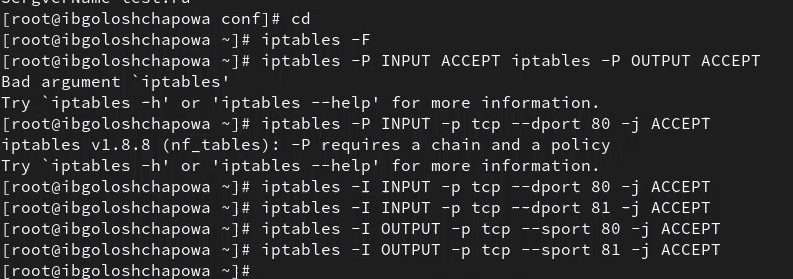{#fig:03 width=50%}

## Выполнение основной части работы

Вошла в систему с полученными учётными данными и убедилась, что SELinux работает в режиме enforcing политики targeted

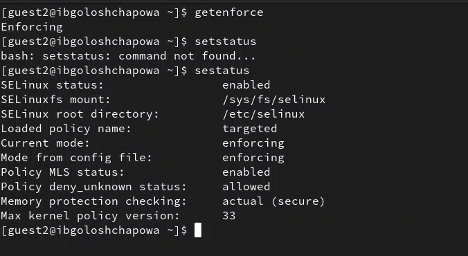{#fig:04 width=50%}

## Выполнение основной части работы

Обратилась с помощью браузера к веб-серверу, запущенному на компьютере, и убедилась, что последний работает 

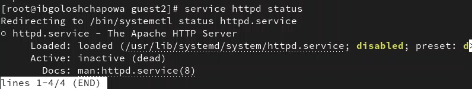{#fig:05 width=50%}

## Выполнение основной части работы

Посмотрела текущее состояние переключателей SELinux для Apache

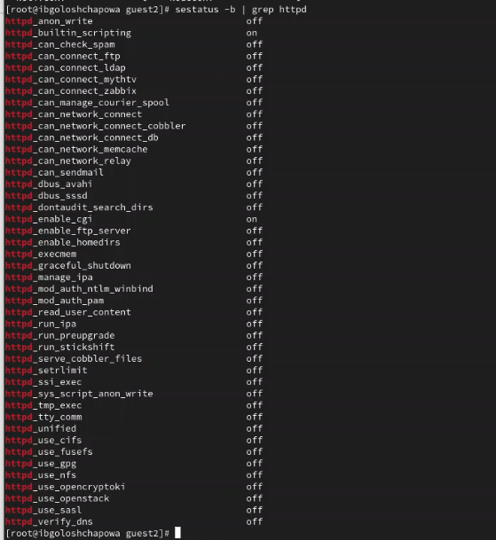{#fig:07 width=30%}

## Выполнение основной части работы

Посмотрела статистику по политике с помощью команды seinfo, также определила множество пользователей, ролей, типов (рис. @fig:08):

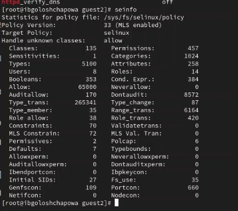{#fig:08 width=50%}

## Выполнение основной части работы

Создала от имени суперпользователя (так как в дистрибутиве после установки только ему разрешена запись в директорию) html-файл следующего содержания 

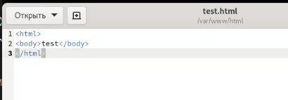{#fig:10 width=50%}

## Выполнение основной части работы

Обратилаась к файлу через веб-сервер, введя в браузере адрес
http://127.0.0.1/test.html 

{#fig:11 width=50%}

## Выполнение основной части работы

Изучила справку man httpd_selinux и выяснила, какие контексты файлов определены для httpd. Сопоставила их с типом файла
test.html. Проверила контекст файла командой ls -Z 

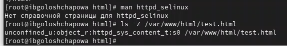{#fig:12 width=50%}

## Выполнение основной части работы

Изменила контекст файла /var/www/html/test.html с
httpd_sys_content_t на другой, к которому процесс httpd не
должен иметь доступа, например, на samba_share_t 

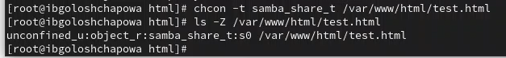{#fig:13 width=50%}

## Выполнение основной части работы

Попробовала запустить веб-сервер Apache на прослушивание ТСР-порта 81 (а не 80, как рекомендует IANA и прописано в /etc/services). Для этого в файле /etc/httpd/httpd.conf найшла строчку Listen 80 и заменила её на Listen 81 

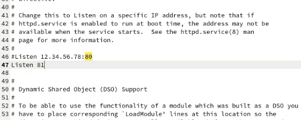{#fig:16 width=50%}

## Выполнение основной части работы

Выполнила команду и после этого проверила список портов

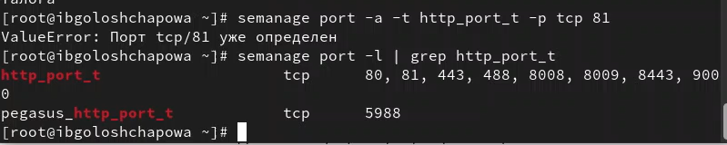{#fig:17 width=50%} 

## Выполнение основной части работы

Вернула контекст httpd_sys_cоntent__t к файлу /var/www/html/ test.html и после этого попробовала получить доступ к файлу через веб-сервер, введя в браузере адрес http://127.0.0.1:81/test.html 

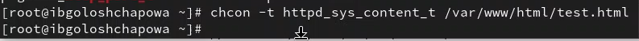{#fig:18 width=50%} 

## Выполнение основной части работы

Исправила обратно конфигурационный файл apache, вернув Listen 80.
Удалила привязку http_port_t к 81 порту и проверьила, что порт 81 удалён.
Затем удалила файл /var/www/html/test.html 

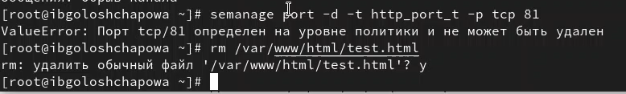{#fig:19 width=50%} 

## Вывод

В ходе лабораторной работы мне удалось:

 - Развить навыки администрирования ОС Linux. Получить первое практическое знакомство с технологией SELinux1;

 - Проверить работу SELinx на практике совместно с веб-сервером Apache
