---
# Front matter
lang: ru-RU
title: "Отчёт по лабораторной работе №6"
subtitle: "Мандатное разграничение прав в Linux"
author: "Голощапова Ирина Борисовна"

# Formatting
toc-title: "Содержание"
toc: true # Table of contents
toc_depth: 2
lof: true # List of figures
lot: true # List of tables
fontsize: 12pt
linestretch: 1.5
papersize: a4paper
documentclass: scrreprt
polyglossia-lang: russian
polyglossia-otherlangs: english
mainfont: PT Serif
romanfont: PT Serif
sansfont: PT Sans
monofont: PT Mono
mainfontoptions: Ligatures=TeX
romanfontoptions: Ligatures=TeX
sansfontoptions: Ligatures=TeX,Scale=MatchLowercase
monofontoptions: Scale=MatchLowercase
indent: true
pdf-engine: lualatex
header-includes:
  - \linepenalty=10 # the penalty added to the badness of each line within a paragraph (no associated penalty node) Increasing the value makes tex try to have fewer lines in the paragraph.
  - \interlinepenalty=0 # value of the penalty (node) added after each line of a paragraph.
  - \hyphenpenalty=50 # the penalty for line breaking at an automatically inserted hyphen
  - \exhyphenpenalty=50 # the penalty for line breaking at an explicit hyphen
  - \binoppenalty=700 # the penalty for breaking a line at a binary operator
  - \relpenalty=500 # the penalty for breaking a line at a relation
  - \clubpenalty=150 # extra penalty for breaking after first line of a paragraph
  - \widowpenalty=150 # extra penalty for breaking before last line of a paragraph
  - \displaywidowpenalty=50 # extra penalty for breaking before last line before a display math
  - \brokenpenalty=100 # extra penalty for page breaking after a hyphenated line
  - \predisplaypenalty=10000 # penalty for breaking before a display
  - \postdisplaypenalty=0 # penalty for breaking after a display
  - \floatingpenalty = 20000 # penalty for splitting an insertion (can only be split footnote in standard LaTeX)
  - \raggedbottom # or \flushbottom
  - \usepackage{float} # keep figures where there are in the text
  - \floatplacement{figure}{H} # keep figures where there are in the text
---

# Цели и задачи лабораторной работы

## Цели и задачи работы

Развить навыки администрирования ОС Linux. Получить первое практическое знакомство с технологией SELinux1.
Проверить работу SELinx на практике совместно с веб-сервером Apache.

# Выполнение лабораторной работы

## Подготовка к выполнению работы

1. Установила от имени администратора httpd (рис. @fig:01)

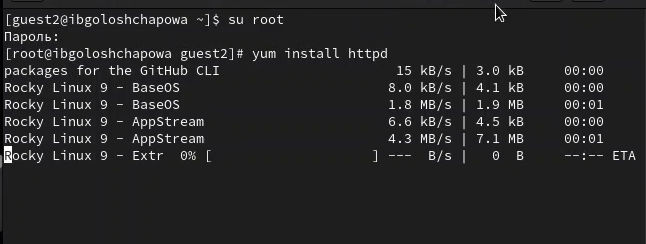{#fig:01 width=50%}

2. В конфигурационном файле /etc/httpd/httpd.conf задала параметр ServerName (рис. @fig:02):

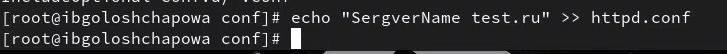{#fig:02 width=50%}

3. Также проследила, чтобы пакетный фильтр был отключён или в своей рабочей конфигурации позволял подключаться к 80-у и 81-у портам протокола tcp (рис. @fig:03):

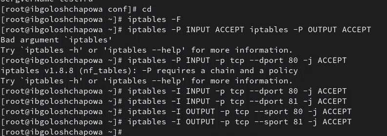{#fig:03 width=50%}

## Выполнение основной части работы

1. Вошла в систему с полученными учётными данными и убедилась, что SELinux работает в режиме enforcing политики targeted (рис. @fig:04):

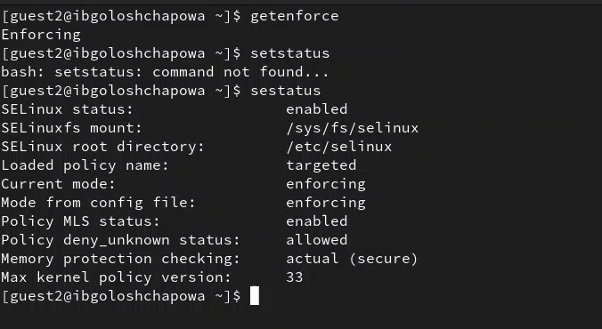{#fig:04 width=50%}

2. Обратилась с помощью браузера к веб-серверу, запущенному на компьютере, и убедилась, что последний работает (рис. @fig:05):

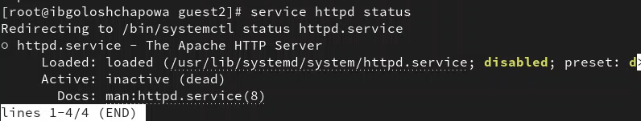{#fig:05 width=50%}

3. Нашла веб-сервер Apache в списке процессов, определила его контекст безопасности (рис. @fig:06):

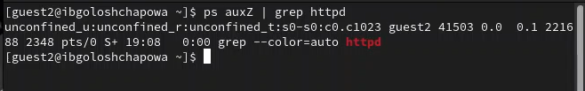{#fig:06 width=50%}

4. Посмотрела текущее состояние переключателей SELinux для Apache (рис. @fig:07):

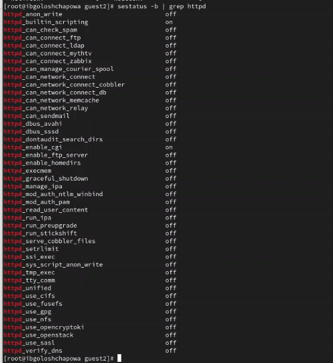{#fig:07 width=50%}

5. Посмотрела статистику по политике с помощью команды seinfo, также определила множество пользователей, ролей, типов (рис. @fig:08):

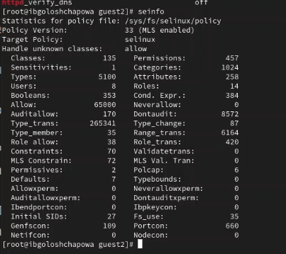{#fig:08 width=50%}

6. Определила тип файлов и поддиректорий, находящихся в директории
/var/www (рис. @fig:09):

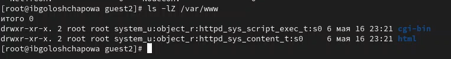{#fig:09 width=50%}

7. Создала от имени суперпользователя (так как в дистрибутиве после установки только ему разрешена запись в директорию) html-файл
/var/www/html/test.html следующего содержания (рис. @fig:10):

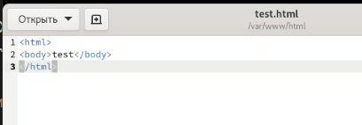{#fig:10 width=50%}

8. Обратилаась к файлу через веб-сервер, введя в браузере адрес
http://127.0.0.1/test.html (рис. @fig:11):

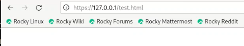{#fig:11 width=50%}

9. Изучила справку man httpd_selinux и выяснила, какие контексты файлов определены для httpd. Сопоставила их с типом файла
test.html. Проверила контекст файла командой ls -Z (рис. @fig:12):

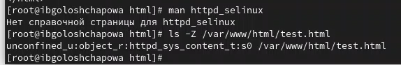{#fig:12 width=50%}

10. Изменила контекст файла /var/www/html/test.html с
httpd_sys_content_t на другой, к которому процесс httpd не
должен иметь доступа, например, на samba_share_t (рис. @fig:13):

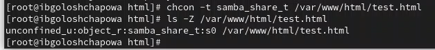{#fig:13 width=50%}

11. Проанализировала ситуацию. Просмотрела log-файлы веб-сервера Apache. Также просмотрела системный лог-файл (рис. @fig:14) (рис. @fig:15):

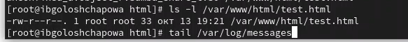{#fig:14 width=50%}

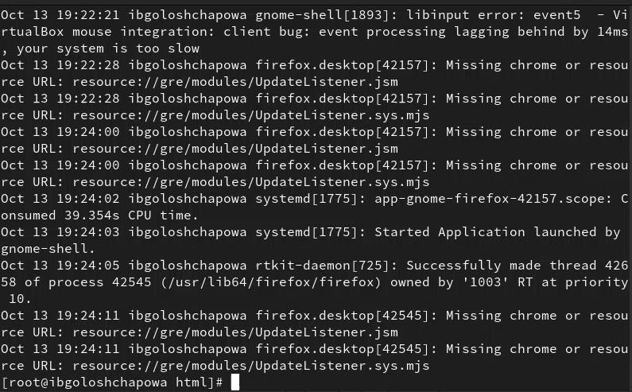{#fig:15 width=50%}

12. Попробовала запустить веб-сервер Apache на прослушивание ТСР-порта 81 (а не 80, как рекомендует IANA и прописано в /etc/services). Для этого в файле /etc/httpd/httpd.conf найшла строчку Listen 80 и
заменила её на Listen 81 (рис. @fig:16):

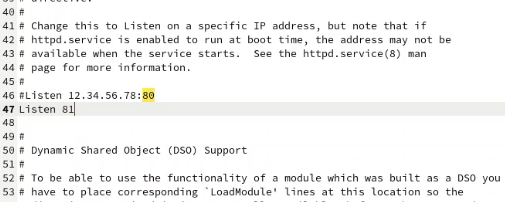{#fig:16 width=50%}

13. Выполнила команду и после этого проверила список портов(рис. @fig:17):

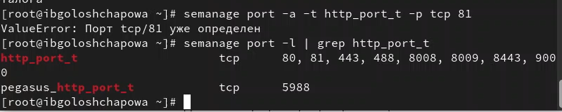{#fig:17 width=50%} 

14. Вернула контекст httpd_sys_cоntent__t к файлу /var/www/html/ test.html и после этого попробовала получить доступ к файлу через веб-сервер, введя в браузере адрес http://127.0.0.1:81/test.html (рис. @fig:18):

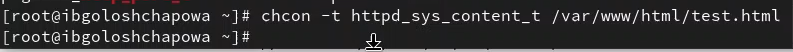{#fig:18 width=50%} 

15. Исправила обратно конфигурационный файл apache, вернув Listen 80.
Удалила привязку http_port_t к 81 порту и проверьила, что порт 81 удалён.
Затем удалила файл /var/www/html/test.html (рис. @fig:19):

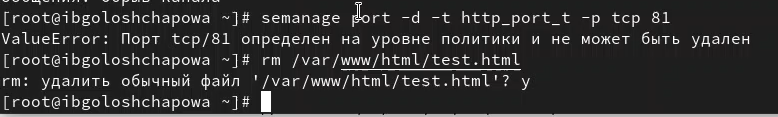{#fig:19 width=50%} 

# Выводы

В ходе лабораторной работы мне удалось:

 - Развить навыки администрирования ОС Linux. Получить первое практическое знакомство с технологией SELinux1;

 - Проверить работу SELinx на практике совместно с веб-сервером Apache/

# Библиография
1. [Git - система контроля версий](https://github.com/)

2. [Rocky Linux](https://rockylinux.org/)
