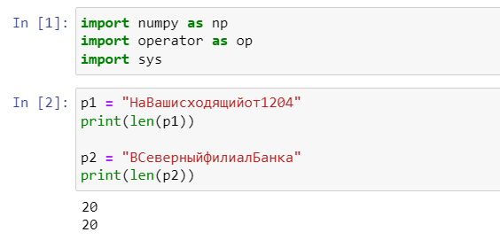
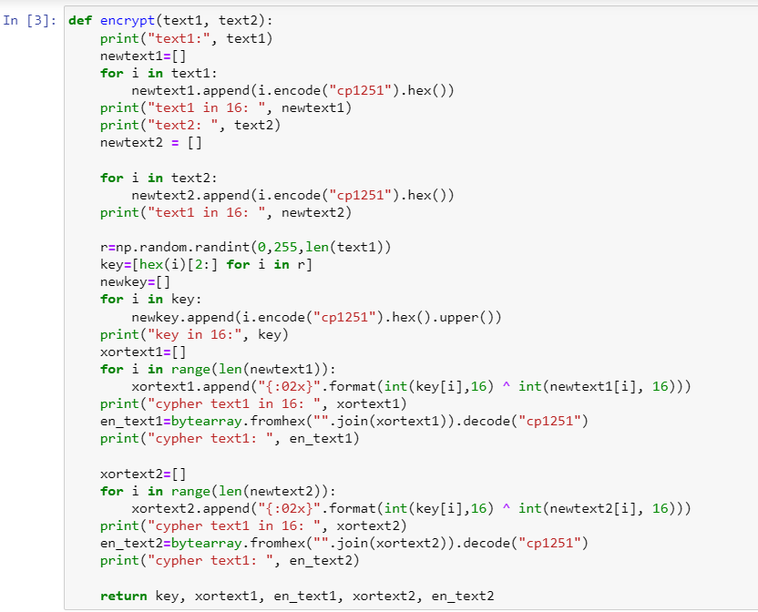
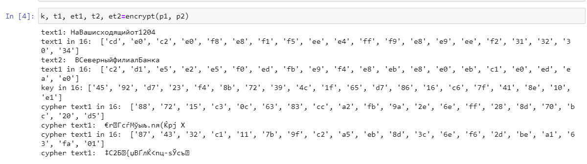
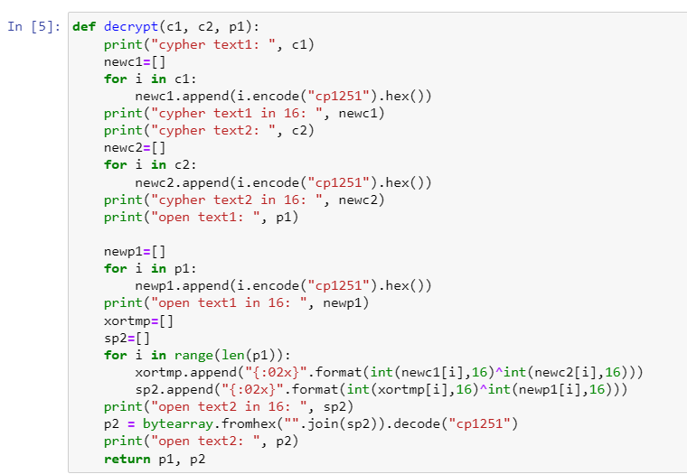
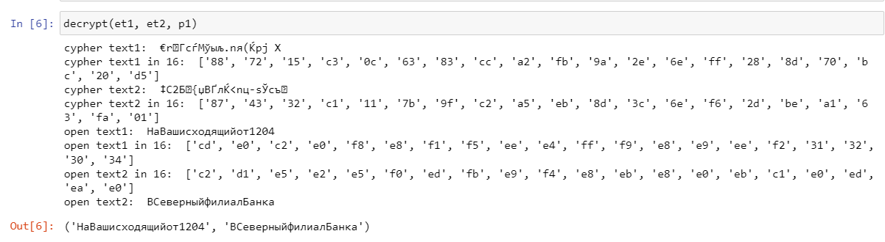

---
# Front matter
lang: ru-RU
title: "Отчёт по лабораторной работе №8"
subtitle: "Элементы криптографии. Шифрование (кодирование) различных исходных текстов одним ключом"
author: "Голощапова Ирина Борисовна"

# Formatting
toc-title: "Содержание"
toc: true # Table of contents
toc_depth: 2
lof: true # List of figures
lot: true # List of tables
fontsize: 12pt
linestretch: 1.5
papersize: a4paper
documentclass: scrreprt
polyglossia-lang: russian
polyglossia-otherlangs: english
mainfont: PT Serif
romanfont: PT Serif
sansfont: PT Sans
monofont: PT Mono
mainfontoptions: Ligatures=TeX
romanfontoptions: Ligatures=TeX
sansfontoptions: Ligatures=TeX,Scale=MatchLowercase
monofontoptions: Scale=MatchLowercase
indent: true
pdf-engine: lualatex
header-includes:
  - \linepenalty=10 # the penalty added to the badness of each line within a paragraph (no associated penalty node) Increasing the value makes tex try to have fewer lines in the paragraph.
  - \interlinepenalty=0 # value of the penalty (node) added after each line of a paragraph.
  - \hyphenpenalty=50 # the penalty for line breaking at an automatically inserted hyphen
  - \exhyphenpenalty=50 # the penalty for line breaking at an explicit hyphen
  - \binoppenalty=700 # the penalty for breaking a line at a binary operator
  - \relpenalty=500 # the penalty for breaking a line at a relation
  - \clubpenalty=150 # extra penalty for breaking after first line of a paragraph
  - \widowpenalty=150 # extra penalty for breaking before last line of a paragraph
  - \displaywidowpenalty=50 # extra penalty for breaking before last line before a display math
  - \brokenpenalty=100 # extra penalty for page breaking after a hyphenated line
  - \predisplaypenalty=10000 # penalty for breaking before a display
  - \postdisplaypenalty=0 # penalty for breaking after a display
  - \floatingpenalty = 20000 # penalty for splitting an insertion (can only be split footnote in standard LaTeX)
  - \raggedbottom # or \flushbottom
  - \usepackage{float} # keep figures where there are in the text
  - \floatplacement{figure}{H} # keep figures where there are in the text
---

# Цель работы

Освоить на практике применение режима однократного гаммирования
на примере кодирования различных исходных текстов одним ключом.

# Теоретическое введение

Предложенная Г. С. Вернамом так называемая «схема однократного использования (гаммирования)» является простой, но надёжной схемой шифрования данных.
Гаммирование представляет собой наложение (снятие) на открытые (зашифрованные) данные последовательности элементов других данных, полученной с помощью некоторого криптографического алгоритма, для получения зашифрованных (открытых) данных. Иными словами, наложение
гаммы — это сложение её элементов с элементами открытого (закрытого)
текста по некоторому фиксированному модулю, значение которого представляет собой известную часть алгоритма шифрования.

# Постановка задачи

Два текста кодируются одним ключом (однократное гаммирование).
Требуется не зная ключа и не стремясь его определить, прочитать оба текста. Необходимо разработать приложение, позволяющее шифровать и дешифровать тексты P1 и P2 в режиме однократного гаммирования. Приложение должно определить вид шифротекстов C1 и C2 обоих текстов P1 и P2 при известном ключе; 

Необходимо определить и выразить аналитически способ, при котором злоумышленник может прочитать оба текста, не
зная ключа и не стремясь его определить.

# Выполнение лабораторной работы

1. Для написания программы использовала язык Python.
Для начала импортировала необходимые библиотеки и задала две исходные строки равной длины (рис. @fig:01)

{#fig:01 width=60%}

2. Написала функцию, которая определяет вид шифротекстов обеих строк при известном ключе(рис. @fig:02)

Функция получает на вход две символьные строки, переводит их в 16-ый форма и генерирует 16-ый ключ.
Далее с помощью данного ключа вычисляются шифротексты в 16-ой СС и переводятся в строковый формат.

{#fig:02 width=70%}

3. Проверила работу первой функции (рис. @fig:03)

{#fig:03 width=70%}

4. Написала функцию, которая при известных двух шифротекстах и одном открытом тексте находит вид второго открытого текста без ключа (рис. @fig:04)

Функция получает на вход две зашифрованные строки и один открытый текст. Далее шифротексты переводятся в 16-ый формат и применяется принцип однократного гаммирования. 
Находится вид второго сообщения без использования ключа и возвращается расшифрованное сообщение.

{#fig:04 width=70%}

5. Проверила работу функции расшифрования (рис. @fig:05)

{#fig:05 width=70%}

# Выводы

В ходе лабораторной работы мне удалось освоить на практике применение режима однократного гаммирования
на примере кодирования различных исходных текстов одним ключом.

# Библиография
1. [Git - система контроля версий](https://github.com/)

2. [Rocky Linux](https://rockylinux.org/)

3. [Элементы криптографии](https://studopedia.su/10_105527_elementi-kriptografii.html)

4. [Однократное гаммирование](https://bugtraq.ru/library/books/crypto/chapter7/)
